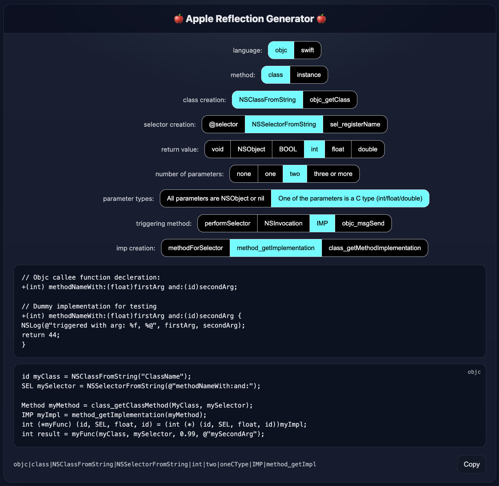

# AppleReflectionGenerator
A tool for generating code that utilizes reflection to trigger objc methods from objc or swift





## Usage

Visit the [webpage](https://chensokolovsky.github.io/AppleReflectionGenerator/tool/index.html)

or run locally:
```
$ git clone https://github.com/chensokolovsky/AppleReflectionGenerator.git
$ cd AppleReflectionGenerator/tool
$ open index.html
```

Then, select the method to your liking/needs.
Top code block shows a decleration and implementation of the callee for testing. you can copy and rename as needed, or copy as is into the fiftyWays project.  
Bottom code block contains the code for trigerring the method with reflection

## Read more
In the [blog post](https://chensokolovsky.github.io/FuzzerAmoreBlog/posts/FuzzerAmore.html)

## Fifty Ways App
should be there after cloning ```AppleReflectionGenerator/fiftyWays```.  
This has placeholders for the callee and calling from both objc and swift

## Options
Note that some options are not available, depending on the selection of other options. The UI will take care of removing the ones that should not exist on each combination

```
language: objc/swift - the language of the code for triggering the callee (calee is always objc)

method: class/instance - class methods are static methods called upon the class vs. instance methods upon an instnace

class creation: how the class is created from string. In case of instnace method, can be created using reflection as well by triggering "new" or "alloc" and "init"

selector creation: There are 7 total options for creating the selector (3 in objc and 4 in swift). See blog post for more details.

return value: void/NSObject(or subclasses)/BOOL/int/float/double

number of parameters: 0/1/2/3 or more

parameters types: all NSObject (or subclasses) / at least one C primitive (int/float/...)

trigerring method: performSelector/NSInvocation/IMP/objc_msgSend. Some of these options are not available for all scenarios. See blog post.

IMP creation: different ways of obtaining the IMP. These options are visible only if IMP is the selected triggering method
```

## License
[Apache 2.0](./LICENSE)

